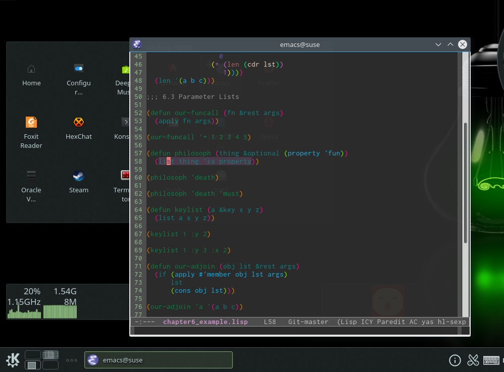

### How to use it:

- git clone https://github.com/liuxueyang/emacsplugin.git ~/.emacs.d

- Install Inconsolata font in Extra directory.

- Enjoy Emacs.

__There are some documents for some plugins in doc directory.__

### Other Linux configuration

#### conky
cp dotconfig/conkyrc ~/.conkyrc

#### openbox
cp -r dotconfig/openbox ~/.config

#### slim
sudo cp dotconfig/slim.conf /etc/slim.conf

#### tint2
cp -r dotconfig/tint2 ~/.config

#### xinitrc
cp dotconfig/xinitrc ~/.xinitrc

#### xcompmgr
sudo cp dotconfig/xcompmgr_openbox /usr/bin

