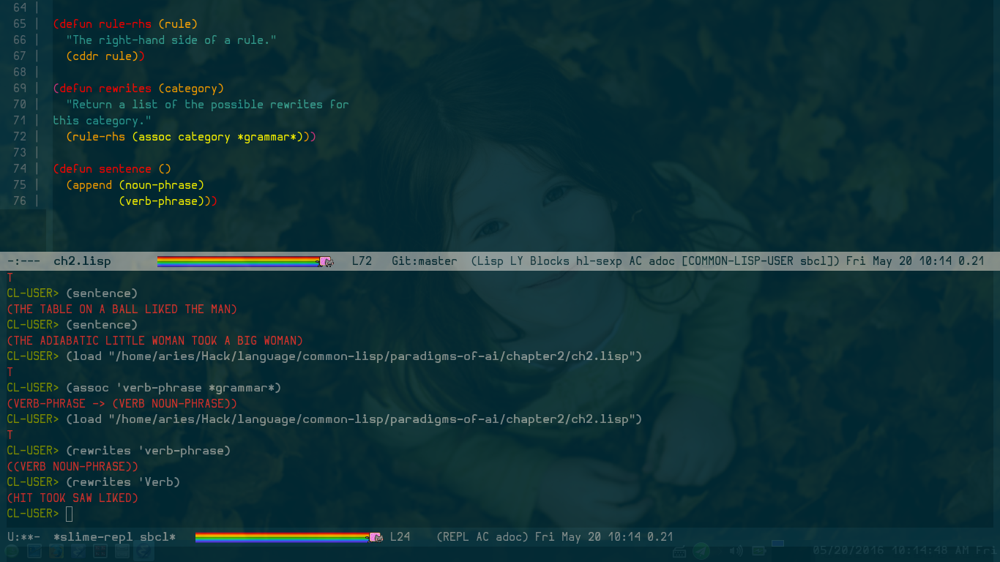

# EmacsPlugin

My Simple and Light configuration for Emacs. :)

Zhen - Yi Jian Setup :joy: :joy: :joy:

为了愉快地写Lisp系的语言，这是一个简单的配置，安装很简单：

```
mkdir ~/Bin
cd ~/Bin && ln -s `which sbcl` sbcl
mv ~/.emacs ~/backup.emacs # 如果~/.emacs这个文件存在的话
mv ~/.emacs.d ~/backup.emacs.d  # 如果~/.emacs.d这个目录存在的话
git clone https://github.com/liuxueyang/Emacsplugin ~/.emacs.d
```

然后重新启动Emacs就好了～

我的Emacs的截图：



----

PS:

1. 有的时候第一次安装有些插件可能会安装失败，启动的时候会有错误，比如
`rainbow-blocks` 这个插件，这个时候就需要输入命令： 
`M-x package-list-packages` 然后找到这个包，按 `d` ，然后按 `x`
删除这个包，然后重启Emacs，会自动重新安装这个失败的包。一般情况下
就没问题了～

2. Gentoo Linux默认安装的Emacs可能并不能改字体，改一下USE就可以了～ 对于
openSUSE Linux、Arch Linux 和Mac OS X亲测都是可以直接使用的 :)

3. Emacs在openSUSE Linux有时候会遇到：

```
Fatal error 11: Segmentation fault
Backtrace:
/usr/bin/emacs[0x4f88ab]
/usr/bin/emacs[0x4de47e]
/usr/bin/emacs[0x4f74ae]
/usr/bin/emacs[0x4f7613]
/lib64/libpthread.so.0(+0xf870)[0x7f7b21543870]
/lib64/libc.so.6(getenv+0xad)[0x7f7b211c31ad]
/usr/lib64/libgtk-3.so.0(+0x1c6bcf)[0x7f7b26113bcf]
/usr/lib64/libgtk-3.so.0(gtk_event_controller_handle_event+0x7b)[0x7f7b260e7d6b]
/usr/lib64/libgtk-3.so.0(+0x3348fd)[0x7f7b262818fd]
/usr/lib64/libgtk-3.so.0(+0x3383c9)[0x7f7b262853c9]
/usr/lib64/libgtk-3.so.0(+0x2071a8)[0x7f7b261541a8]
/usr/lib64/libgtk-3.so.0(gtk_main_do_event+0x464)[0x7f7b26155a04]
/usr/lib64/libgdk-3.so.0(+0x533d2)[0x7f7b25cf33d2]
/usr/lib64/libglib-2.0.so.0(g_main_context_dispatch+0x254)[0x7f7b24c7cc84]
/usr/lib64/libglib-2.0.so.0(+0x4bed8)[0x7f7b24c7ced8]
/usr/lib64/libglib-2.0.so.0(g_main_context_iteration+0x2c)[0x7f7b24c7cf7c]
/usr/lib64/libgtk-3.so.0(gtk_main_iteration+0x15)[0x7f7b26154fa5]
/usr/bin/emacs[0x4b38d2]
/usr/bin/emacs[0x4e56d1]
/usr/bin/emacs[0x4e50f5]
/usr/bin/emacs[0x4e5f49]
/usr/bin/emacs[0x4e5fa3]
/usr/bin/emacs[0x4e6532]
/usr/bin/emacs[0x596502]
/usr/bin/emacs[0x55162f]
/usr/bin/emacs[0x55275c]
/usr/bin/emacs[0x55162f]
/usr/bin/emacs[0x5860cb]
/usr/bin/emacs[0x55112f]
/usr/bin/emacs[0x55143b]
/usr/bin/emacs[0x55275c]
/usr/bin/emacs[0x55162f]
/usr/bin/emacs[0x5860cb]
/usr/bin/emacs[0x550eff]
/usr/bin/emacs[0x55143b]
/usr/bin/emacs[0x55275c]
/usr/bin/emacs[0x55162f]
/usr/bin/emacs[0x5860cb]
/usr/bin/emacs[0x550eff]
/usr/bin/emacs[0x55143b]
/usr/bin/emacs[0x55275c]
...
[1]    5320 segmentation fault  emacs README.md

```

这个嘛，应该是Emacs的GTK问题……写东西的时候还是要经常 `C-x C-s` 保存文件，以防
万一，有一个办法是，用emacs-x11，这样就不会使用GTK。

## Update on 2016/05/20

还是自己编译源程序升级到最新版的24.5吧，有新特性，用了几天，并不会出现上面的问题。
棒棒哒 :joy::joy:

## Update on 2016/06/14

增加了几个插件，自动补全，最大列提示。


### TODO

* DONE 增加一个可以实时预览markdown的插件
  CLOSED: [2016-06-14 Tue 08:57]
* DONE 让编辑markdown文件更方便的插件
  CLOSED: [2016-06-14 Tue 08:57]

## Update on 2016/07/04

增加dotspacemacs和dotemacs文件。通过

```
cd ~
mv .emacs dotemacs-backup
mv .spacemacs dotemacs-backup
ln -s .emacs.d/dotemacs .emacs
ln -s .emacs.d/dotspacemacs .spacemacs
```

来让自己原来的Emacs配置和Spacemacs共存。想要切换只需要修改dotemacs文件就可以了。
